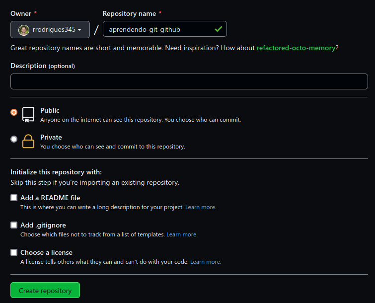
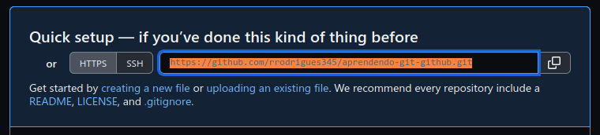

Olá! 

Neste projeto, a Rafaella Ballerini ensina a utilizar o Git. Acompanhe as instruções pelo vídeo:

[](https://www.youtube.com/watch?v=UBAX-13g8OM)

Abaixo, um passo a passo das etapas, para consulta posterior =). 


## Introdução

GitHub é uma plataforma de hospedagem de código para controle de versões e colaboração, possibilitando trabalho em conjunto em projetos de qualquer lugar do mundo. 

### Repositório

De forma geral, repositórios são utilizados para organizar um único projeto. Podem conter pastas e arquivos, imagens, vídeos, planilhas e tudo o mais necessário a seu projeto. Frequentemente, os repositórios incluem um arquivo `README`, um tipo de arquivo que contém informação sobre o seu projeto. 

### Iniciando um projeto

#### Iniciando o Git no Terminal

- Crie uma pasta no seu computador com o nome do projeto: `aprendendo-git-github`.
- Comece a criar os arquivos dentro de sua pasta.
    - vc pode abrir a pasta direto pelo Visual Studio Code ou outra IDE de sua preferência.
- Inicie o git: 
    - `git init`
- Adicione os arquivos criados: `git add .`
- Veja o status do git com o comando: `git status`

``` bash
rrodrigues@debian:~/projetos/aprendendo-git-github (master)$ git status 

On branch master

No commits yet

Changes to be committed:
  (use "git rm --cached <file>..." to unstage)
	new file:   Projeto.md
	new file:   Readme.md
	new file:   img/criando-repositorio.png
	new file:   img/link-do-repositorio.png
```

- faça seu primeiro commit: `git commit -m "Primeiro commit do projeto!"`

``` bash
rrodrigues@debian:~/projetos/aprendendo-git-github (master)$ git commit -m "Primeiro commit!"

[master (root-commit) 2d40d94] Primeiro commit!
 4 files changed, 57 insertions(+)
 create mode 100644 Projeto.md
 create mode 100644 Readme.md
 create mode 100644 img/criando-repositorio.png
 create mode 100644 img/link-do-repositorio.png

```

- Vamos trocar o nome da branch de **master** para **main**: `git branch -M "main"`

``` bash
rrodrigues@debian:~/projetos/aprendendo-git-github (main)$ git status 
On branch main
Changes not staged for commit:
  (use "git add <file>..." to update what will be committed)
  (use "git restore <file>..." to discard changes in working directory)
	modified:   Readme.md

no changes added to commit (use "git add" and/or "git commit -a")
```
Veja que o arquivo Readme.md está indicado como: **"modified:   Readme.md"**, pois estou editando este arquivo durante o commit.

#### Criando o projeto no GitHub

- No github, na sua conta de usuário, crie um projeto. Vá em **Novo** --> **Repositório** e crie a pasta **aprendendo-git-github**. Marque a opção **"Público"** e clique em **"Criar repositório"**.



Na página de instruções que abrir, copie o link do seu repositório do github:



O meu link aqui, por exemplo, ficará desta forma:
`https://github.com/rrodrigues345/aprendendo-git-github.git`

#### Conectando Git & GitHub =)

De posse do link do repositório no GitHub, vamos conectar o git com o repositório do github:

`git remote add origin https://github.com/rrodrigues345/aprendendo-git-github.git`

Feito isso, podemos enviar os arquivos para nosso repositório, usando o comando: `git push -u origin main`

``` bash
rrodrigues@debian:~/projetos/aprendendo-git-github (main)$ git push -u origin main 
Username for 'https://github.com': rrodrigues345
Password for 'https://rrodrigues345@github.com': 
Enumerating objects: 7, done.
Counting objects: 100% (7/7), done.
Delta compression using up to 8 threads
Compressing objects: 100% (6/6), done.
Writing objects: 100% (7/7), 80.73 KiB | 10.09 MiB/s, done.
Total 7 (delta 0), reused 0 (delta 0), pack-reused 0
To https://github.com/rrodrigues345/aprendendo-git-github.git
 * [new branch]      main -> main
Branch 'main' set up to track remote branch 'main' from 'origin'.
rrodrigues@debian:~/projetos/aprendendo-git-github (main)$ 
```

#### Criando ramificações no projeto (*Branch*)

- As ramificações (*branchs*) são utilizadas quando queremos adicionar alguma nova funcionalidade (*feature*) no projeto, isto é, adicionar uma nova página, por exemplo. 
- Primeiro então, criamos a *branch* só depois fazemos as alterações. Utilizamos o comando `checkout`para sairmos da *branch* em que estamos e `-b "nome-da-nova-branch"`para irmos para a nova ramificação:
  - `git checkout -b "novo-botao"`.
    - faz alterações desejadas nos arquivos existentes ou cria um novo arquivo.

``` bash
rrodrigues@debian:~/projetos/aprendendo-git-github (main)$ git checkout -b "novo-botao"
Switched to a new branch 'novo-botao'

rrodrigues@debian:~/projetos/aprendendo-git-github (novo-botao)$ git status
On branch novo-botao
Changes not staged for commit:
  (use "git add <file>..." to update what will be committed)
  (use "git restore <file>..." to discard changes in working directory)
	modified:   Readme.md

no changes added to commit (use "git add" and/or "git commit -a")

rrodrigues@debian:~/projetos/aprendendo-git-github (novo-botao)$ 
```  

Como o terminal indica, estamos na *branch* novo-botão. Então, podemos criar/editar os arquivos que farão parte desta ramificação e usamos os mesmos comandos anteriores para sincronizar com a pasta do projeto, no GitHub:

1. `git add .`
2. `git commit -m "novo botao criado"`
3. `git push origin novo-botao`

```bash
rrodrigues@dell:~/projetos/aprendendo-git-github (novo-botao)$ git push origin novo-botao 
Username for 'https://github.com': rrodrigues345
Password for 'https://rrodrigues345@github.com': 
Enumerating objects: 6, done.
Counting objects: 100% (6/6), done.
Delta compression using up to 8 threads
Compressing objects: 100% (4/4), done.
Writing objects: 100% (4/4), 1.25 KiB | 1.25 MiB/s, done.
Total 4 (delta 1), reused 0 (delta 0), pack-reused 0
remote: Resolving deltas: 100% (1/1), completed with 1 local object.
remote: 
remote: Create a pull request for 'novo-botao' on GitHub by visiting:
remote:      https://github.com/rrodrigues345/aprendendo-git-github/pull/new/novo-botao
remote: 
To https://github.com/rrodrigues345/aprendendo-git-github.git
 * [new branch]      novo-botao -> novo-botao
rrodrigues@dell:~/projetos/aprendendo-git-github (novo-botao)$ 
``` 

#### Juntando as ramificações (*merge*)

1. `git checkout main`
2. 


## Referências

1. https://docs.github.com/en/get-started/quickstart/hello-world
2. Ballerini, Rafaella. 2021. Como usar Git e GitHub na prática: do primeiro commit até o pull request. Disponível em: https://www.youtube.com/watch?v=UBAX-13g8OM.